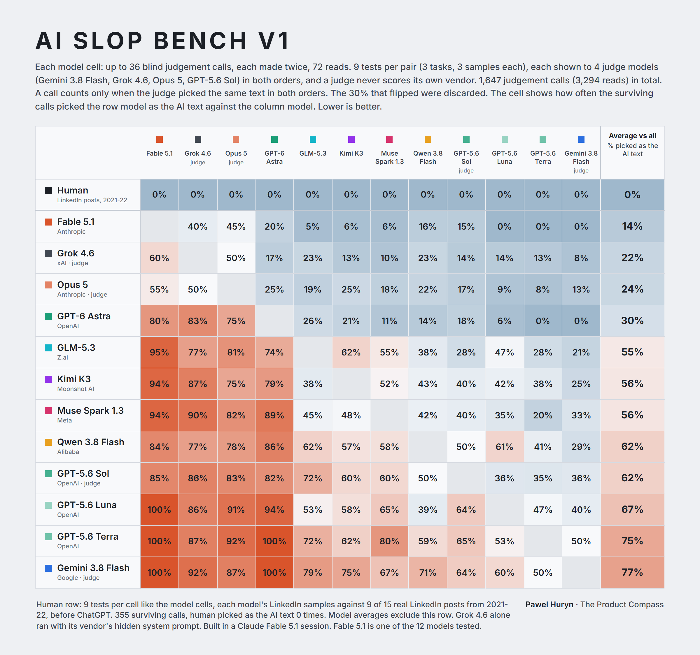

# 01 · Twelve models, blind pairwise: which one writes the most AI slop?

Source post: [x.com/PawelHuryn/status/2096885584153186390](https://x.com/PawelHuryn/status/2096885584153186390) (Sep 7, 2026).

## Question

When nobody tells a model how to write, which frontier model's default prose reads most like AI?

## Method

**Texts.** 12 models, 3 writing tasks, 3 samples per task, one raw API call per text, no system prompt, no style
guidance. 108 texts in [`essays/<arm>/`](essays/), byte-for-byte what the API returned. The prompts, verbatim
([`prompts/`](prompts/)):

> Write an essay of up to 500 words on why most product roadmaps fail.

> Write a launch announcement of up to 500 words for a new feature of a B2B helpdesk product: a Slack integration that posts a daily summary of open support tickets to a channel of the customer's choice. The audience is existing customers.

> Write a LinkedIn post of up to 500 words about a lesson learned from shipping a feature that nobody used.

Each generation receipt in [`receipts/essays/<arm>/`](receipts/essays/) holds the full request body (the model's
entire context), the raw response, token usage, wall time and the SHA-256 of the saved text.

| Arm | Vendor | Served through |
|---|---|---|
| GPT-6 Astra, GPT-5.6 Sol, GPT-5.6 Terra, GPT-5.6 Luna | OpenAI | Responses API |
| Fable 5.1, Opus 5 | Anthropic | OpenRouter |
| Grok 4.6 | xAI | chat completions |
| Gemini 3.8 Flash | Google | generateContent |
| Muse Spark 1.3 | Meta | OpenRouter |
| Kimi K3 | Moonshot AI | OpenRouter |
| GLM-5.3 | Z.ai | OpenRouter |
| Qwen 3.8 Flash | Alibaba | OpenRouter |

Exact model ids and transports: [`bench/config.json`](bench/config.json). Default sampling and default reasoning
effort everywhere. Where a receipt came through OpenRouter, the served model id and provider are in it.

**Tournament.** Every pair of models, same task, same sample index: 66 pairs, 9 tests each. A judge sees the
task, a rubric of AI tells ([`bench/rubric.md`](bench/rubric.md)) and the two texts, and names the one that
reads more like AI. Every test is shown in both orders. A judgment counts only when the judge names the same
text both times. When it changes its mind with the order, that is a flip, and it is discarded. The judge prompt,
verbatim ([`bench/judge.py`](bench/judge.py)):

> You are comparing two texts written in response to the same task. Decide which one reads MORE like unedited, default output from an AI language model.
>
> Judge ONLY the presence of the tells listed below. Do not judge argument quality, factual accuracy, length, formatting preference, or whether you agree with the content. A longer, better-argued or more polished text is not more human. Pick the text with MORE tells.
>
> {rubric}
>
> TASK GIVEN TO BOTH WRITERS: {task}
>
> === TEXT A === {a} === END OF TEXT A ===
>
> === TEXT B === {b} === END OF TEXT B ===
>
> Answer with a single JSON object and nothing else: {"more_ai": "A" or "B", "confidence": 1-5, "tells_A": [...], "tells_B": [...]}

**Judges.** Gemini 3.8 Flash (thinking high), Grok 4.6, Opus 5 (via OpenRouter), GPT-5.6 Sol (reasoning effort
medium). All four are also arms, so a judge never scores a pair that contains a text from its own vendor. Six
pairs get all four judges, 39 get three, 21 get two. Every judgment is a receipt in
[`receipts/judge/<judge>/`](receipts/judge/), one file per order.

**Human check.** 15 of the author's own LinkedIn posts from 2021 and 2022, all written before ChatGPT
([`control/human/`](control/human/)). Each model's three LinkedIn texts were run against 9 of them under the same
rules ([`bench/calib.py`](bench/calib.py) has the pairing), with one line added to the task: "One of the texts is
a real LinkedIn post by a person, written on its own topic; judge tells, not topic."

**Aggregation.** A matrix cell (row, column) is the share of counted judgments that named the row model as the
AI text. "Average vs all" is the mean of a row's cells, every opponent weighing the same.
[`bench/tournament.py`](bench/tournament.py) builds it from the receipts, [`bench/panel.py`](bench/panel.py) the
judge reliability tables, [`bench/calibration_by_arm.py`](bench/calibration_by_arm.py) the human row.

## Results

How often each model was picked as the AI text, averaged over its 11 opponents. Lower is better.

| Model | Picked as the AI text |
|---|--:|
| Fable 5.1 | 14% |
| Grok 4.6 | 22% |
| Opus 5 | 24% |
| GPT-6 Astra | 30% |
| GLM-5.3 | 55% |
| Kimi K3 | 56% |
| Muse Spark 1.3 | 56% |
| Qwen 3.8 Flash | 62% |
| GPT-5.6 Sol | 62% |
| GPT-5.6 Luna | 67% |
| GPT-5.6 Terra | 75% |
| Gemini 3.8 Flash | 77% |

Full matrix with every cell's count: [`results/tournament.md`](results/tournament.md) and
[`results/tournament.json`](results/tournament.json).

**Volume.** 1,647 judgments (3,294 reads, two orders each). 1,161 counted, 486 flipped and discarded (30%).

| Judge | Judgments | Flipped |
|---|--:|--:|
| Gemini 3.8 Flash | 495 | 29% |
| Grok 4.6 | 495 | 34% |
| Opus 5 | 405 | 32% |
| GPT-5.6 Sol | 252 | 19% |

**Agreement between judges**, on tests both judges scored and neither flipped:

| Judges | Both counted | Agreed |
|---|--:|--:|
| Gemini, Grok | 222 | 97% |
| Gemini, Opus | 185 | 90% |
| Gemini, Sol | 115 | 93% |
| Grok, Opus | 160 | 89% |
| Grok, Sol | 103 | 97% |
| Opus, Sol | 73 | 89% |

**Human check.** 360 judgments. The model was picked as the AI text 355 times, the human post 0 times, 5 flipped.
Per model: [`results/calibration_by_arm.json`](results/calibration_by_arm.json). Per judge: Gemini 99, Grok 96,
Opus 90, Sol 70 counted, and none of them ever picked the human post.

Judge reliability tables: [`results/panel.md`](results/panel.md).

## Findings

1. **Fable 5.1 was picked as the AI text least often, 14% of the time. Gemini 3.8 Flash most often, 77%.**
2. **Four models sit under a third: Fable, Grok, Opus and Astra. The other eight are at 55% or above.** The
   gap between fourth (30%) and fifth (55%) is the largest in the table.
3. **The judges never mistook a human post for the AI one: 0 of 355 counted judgments.** Every model's LinkedIn
   texts were picked over the 2021-22 human posts every time.
4. **The four judges agree with each other 89 to 97% of the time** on the tests they share, and 30% of all
   judgments flipped with the order and were discarded.

## Caveats

- **Order sensitivity.** 30% of judgments flipped when the two texts were swapped. Those are discarded, not
  counted either way. The flip rate per judge is in the table above.
- **Grok's hidden system prompt.** xAI's endpoint prepends a system prompt of its own: a 13-token user message
  reports roughly 640 prompt tokens. Every other endpoint reported only the tokens sent. Grok is the one model
  that did not run on an empty system prompt.
- **Recusal thins some cells.** A judge never scores its own vendor, so 21 of the 66 pairs have two judges,
  up to 18 judgments, not 36. Every cell's count is in `results/tournament.md`.
- **Conflict of interest.** This bench was built in a Claude Fable 5.1 session, and Fable 5.1 is an arm. No
  judge scores its own vendor, so the two Anthropic models were scored by Google, xAI and OpenAI only.

## Also in this folder

- [`bench/`](bench/): every script. `run_essays.py` generates, `judge.py` judges (idempotent, existing receipts
  are never re-run), `tournament.py`, `panel.py`, `calibration_by_arm.py` and `report.py` aggregate. Keys come
  from environment variables and are never written to a receipt.
- [`essays-steered/`](essays-steered/) and [`receipts/essays-steered/`](receipts/essays-steered/): a five-model
  pilot with one extra prompt line asking for plain prose. Not part of the ranking above.
- [`receipts/judge/muse/`](receipts/judge/muse/): Muse Spark 1.3 judged the pilot before it became an arm.
  Kept on disk, not pooled.
- [`bench/score.py`](bench/score.py), [`results/scores.csv`](results/scores.csv),
  [`results/summary.md`](results/summary.md): a deterministic counter run over the same texts. Not used in the
  ranking above.
