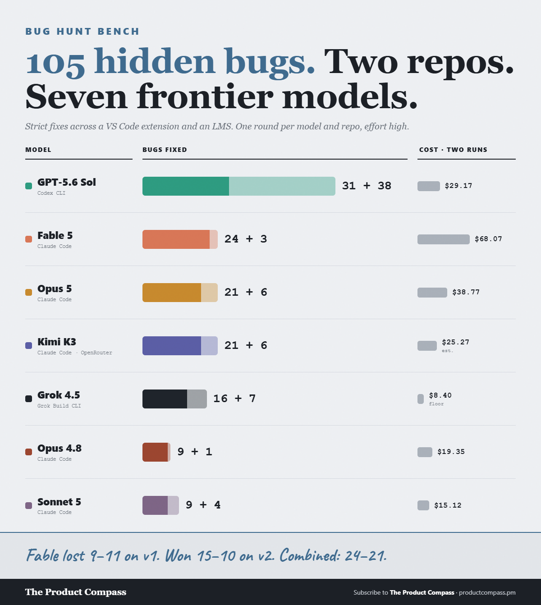
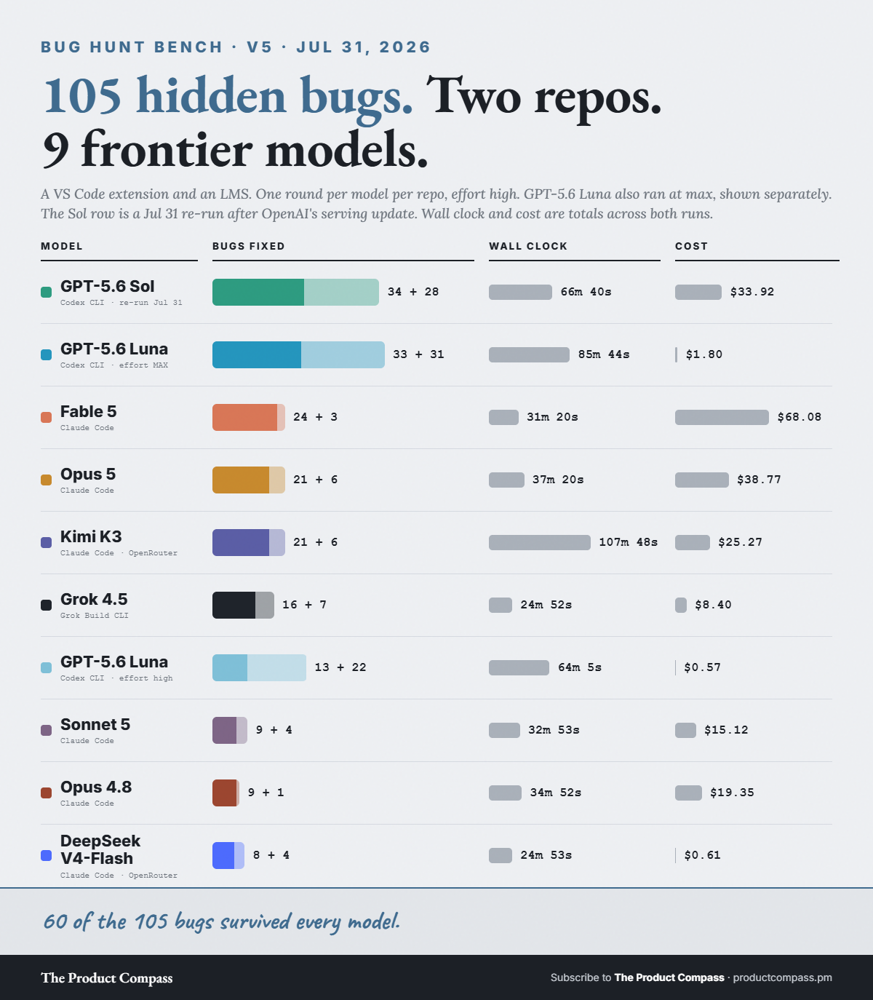
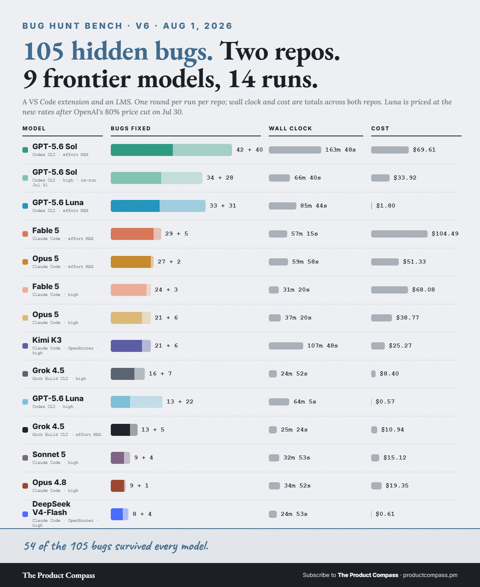
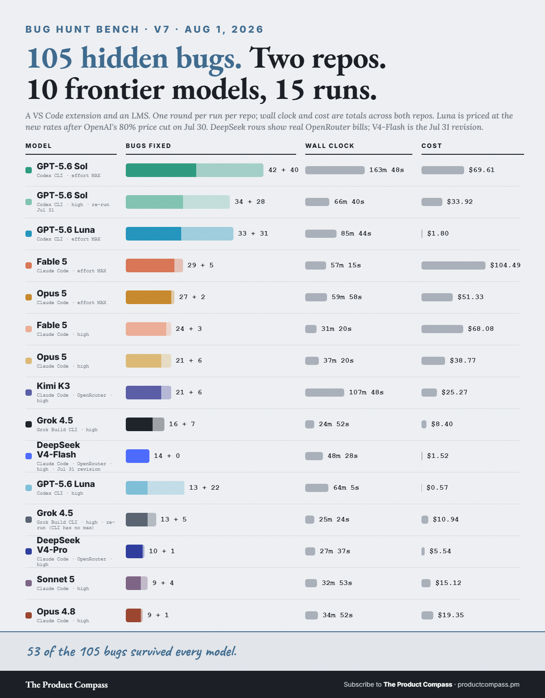
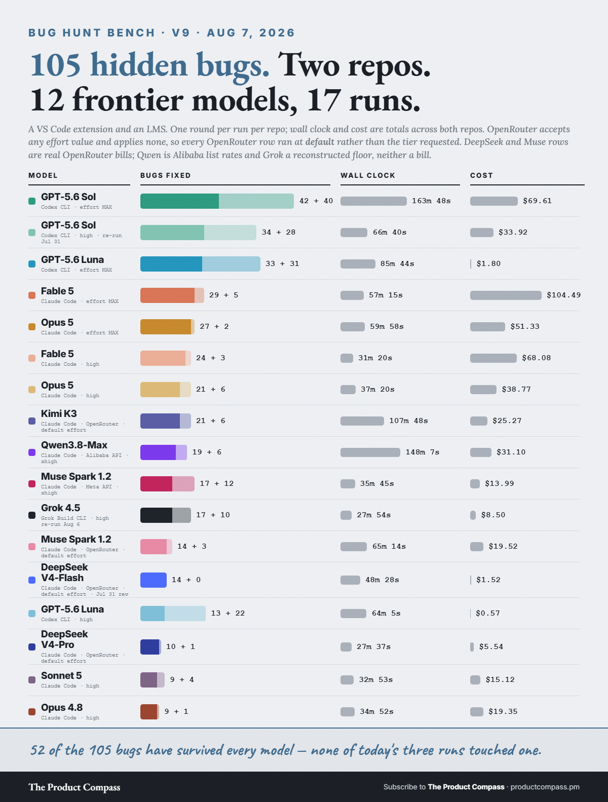
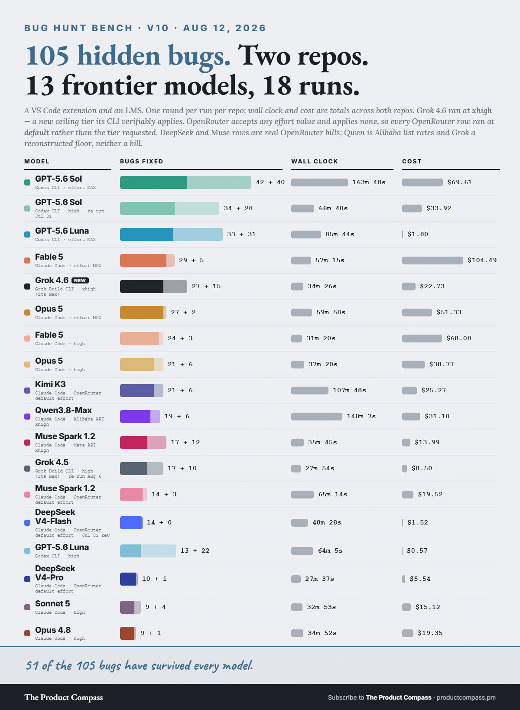
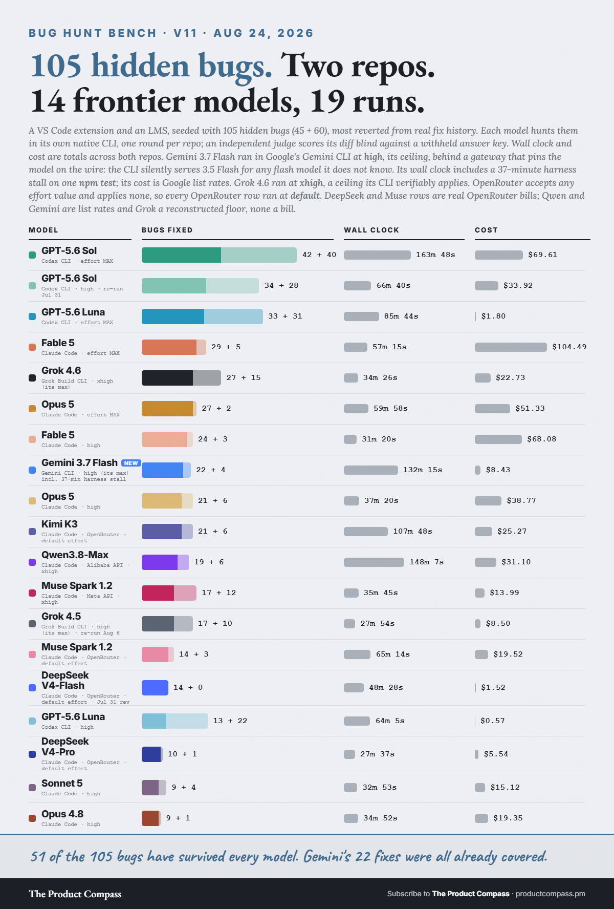

# bug-hunt-bench — 105 planted bugs, two real repos, fourteen coding models

**Question:** Hide bugs in a real codebase, keep the test suite green so nothing points at the
answers, then ask each frontier coding model — in its own native agentic CLI — to find and fix as
many as it can. Who actually fixes the most? And does a leaderboard built on one repo survive a
second, unrelated one?

Run twice, on two codebases that share nothing but a language.

| | Repo 1 | Repo 2 |
|---|---|---|
| What it is | A VS Code / Cursor sidebar extension (ACP client for a coding-agent CLI), ~28K lines TypeScript | A Vite/React/TypeScript LMS backed by Supabase Edge Functions and Clerk, ~60K lines |
| Bugs | **45** — 16 real shipped bugs reverted from the repo's own fix history, 29 authored in the same style | **60** — *every one* a real regression that shipped and was later fixed, each carrying its own fix-commit SHA |
| Green checks kept | 922 tests | 53 unit tests + typecheck + production build |
| Run | Jul 19–26 + Jul 31 – Aug 1, 2026 | Jul 26 + Jul 31 – Aug 1, 2026 |

Repo 2 is the stronger construction: no authored bugs at all. It was also built largely by AI,
and 59 of its 60 original fixes were written by an AI agent rather than a person.

**The task (identical for every model, both repos):** find and fix as many planted bugs as you can,
edit the source in place, keep the checks green (do not weaken tests), and write a `BUGS_FOUND.md`.
One round per model per repo, reasoning effort `high` **as requested** (see the Aug 6-7 wave: some providers silently ignore it), each in its native harness. Exact prompts:
[repo1-prompt.md](repo1-prompt.md) and [repo2-prompt.md](repo2-prompt.md).

**Grading:** each model's diff against the pristine repo is the ground truth — not its own report.
Scored against a withheld answer key by an independent blind judge per arm, submissions anonymized
and decoded only after every verdict is in. Buckets: `FIXED_MATCH` / `FIXED_PARTIAL` /
`CLAIMED_ONLY` / `MISSED`, plus extra fixes classified genuine or false-positive.

## Combined scoreboard

Strict fixes only — no partial credit. [combined-scoreboard.csv](combined-scoreboard.csv)

| Model | Harness | Fixed /105 | Repo 1 /45 | Repo 2 /60 | Genuine extras | Wall | Cost (list-equiv) |
|---|---|--:|--:|--:|--:|--:|--:|
| **GPT-5.6 Sol** | Codex CLI | **31** | 13 | 18 | 38 | 70.2 min | $29.16 |
| **Fable 5** | Claude Code | **24** | 9 | 15 | 3 | 31.4 min | $68.07 |
| **Opus 5** | Claude Code | **21** | 11 | 10 | 6 | 37.4 min | $38.77 |
| **Kimi K3** | Claude Code / OpenRouter | **21** | 4 | 17 | 6 | 107.8 min | $25.27 |
| **Grok 4.5** | Grok Build CLI (ACP) | **16** | 5 | 11 | 7 | 24.9 min | $8.40 floor |
| **Opus 4.8** | Claude Code | **9** | 2 | 7 | 1 | 34.8 min | $19.35 |
| **Sonnet 5** | Claude Code | **9** | 1 | 8 | 4 | 32.8 min | $15.12 |

**63 of the 105 bugs survived every model** in this seven-model wave (60 after the Jul 31 wave,
54 after the Aug 1 max wave, 53 after the DeepSeek follow-up, **52 after the Aug 3 wave**,
still 52 after Aug 6-7 and **51 after the Aug 12 Grok 4.6 wave**). Zero false-positive fixes from any arm on either repo: every
extra fix any model applied was a genuine unplanted defect.

Per-repo detail: [repo1-scoreboard.csv](repo1-scoreboard.csv) · [repo2-scoreboard.csv](repo2-scoreboard.csv).
Wall-clock, tokens and reconstructed cost: [repo1-metrics.csv](repo1-metrics.csv) ·
[repo2-metrics.csv](repo2-metrics.csv).

## Findings

- **One repo was not enough to rank the middle.** Opus 5 beat Fable 5 on repo 1 (11–9) and lost on
  repo 2 (10–15). Kimi K3 went from second-to-last on repo 1 to second on repo 2, finishing level
  with Opus 5 overall at a third less cost. Only first place was stable.
- **GPT-5.6 Sol leads both, and audits beyond the brief.** It fixed **38 genuine defects nobody
  planted** across the two repos — 29 of them on repo 2 alone, where every other model found 1 to 6.
  Cross-tenant quiz access, a `|| 75` coercion silently rewriting a 0% pass mark to 75%, timed quiz
  submissions with no time-limit enforcement.
- **Sonnet 5 on repo 1 is the sharpest single result.** It fixed 1 of 45: two files touched, a 2.9KB
  diff, one correct fix *with a regression test*, then a report claiming an exhaustive line-by-line
  review of the codebase and listing "Suspected but not fixed: None". 44 bugs were still there.
  Confident, thorough-sounding, and wrong.
- **Opus 4.8 → Opus 5 is a real generational jump**: 9 → 21 combined, same harness, same prompt,
  same bugs.
- **Cost is not recall.** Fable 5 cost the most ($68) and placed second. Grok 4.5 was the cheapest
  arm by a wide margin and placed fifth. Kimi K3 matched Opus 5 for a third less money and three
  times the wall clock.

## The Jul 31 wave — two new models, the effort dial, a Sol re-run

On Jul 30 OpenAI cut GPT-5.6 Luna's API price by 80% and shipped serving improvements; DeepSeek
shipped a re-post-trained V4-Flash revision (`-0731`) the next morning. Four new arms ran the
identical two-repo battery on Jul 31, same prompts, same blind-judging pipeline:

| Arm | Effort | Fixed /105 | Repo 1 /45 | Repo 2 /60 | Genuine extras | Wall | Cost (list-equiv) |
|---|---|--:|--:|--:|--:|--:|--:|
| **GPT-5.6 Sol (re-run)** | high | **34** | 13 | 21 | 28 | 66.7 min | $33.92 |
| **GPT-5.6 Luna** | **max** | **33** | 17 | 16 | 31 | 85.7 min | $1.80 |
| **GPT-5.6 Luna** | high | **13** | 5 | 8 | 22 | 64.1 min | $0.57 |
| **DeepSeek V4-Flash** | high | **8** | 4 | 4 | 4 | 24.9 min | $0.61 |

- **Luna at max effort beats Fable 5 on both axes** — 33 strict fixes vs 24, $1.80 vs $68.07 —
  and lands one fix behind the flagship Sol re-run at ~1/19th of its cost. Post-price-cut list
  rates ($0.20/M input, $1.20/M output). Exact, not a floor: re-derived per-request from the
  Codex CLI session rollouts - the CLI pins context at 258,400 tokens, below OpenAI's 272K
  long-context surcharge line, so no request in any run hit surcharge pricing.
- **The effort dial is worth 2.5x on Luna.** Same model, same prices: 13 strict fixes at `high`,
  33 at `max`. On repo 1, `max` was also 2.4x *faster* than `high` (21.5 vs 51.1 min).
- **The Sol re-run measures OpenAI's serving update.** Repo 2: 21 fixes vs 18 in the Jul 26 run,
  29.5 min vs 48.3, $14.36 vs $18.40 — better on all three axes. Repo 1: the same 13-fix count as
  Jul 26 but a partially different set of bugs, slower and pricier on that leg. List prices
  unchanged; the wall/cost gains are serving-side.
- **DeepSeek V4-Flash is last on coverage and untouchable on absolute price**: 8 of 105 for $0.61
  total (real OpenRouter bill cross-checked at $0.62). Ran through the same OpenRouter shim as
  Kimi K3, reasoning effort high, 1M context. **Version correction (Aug 1):** the base OpenRouter
  slug this run used resolves to the **April snapshot** (`deepseek-v4-flash-20260423` on every
  provider behind it, per the endpoints API) — not the Jul 31 re-post-trained revision, which is
  a separate `-0731` model id. So this row measures the April model. The `-0731` revision was
  benched separately on Aug 1.
- **Survivors: 63 → 60.** Luna-high fixed one repo-1 bug that had survived all prior arms
  (including Luna-max — different effort levels catch different bugs), and the Sol re-run fixed
  two repo-2 survivors. Every other new-arm fix was already covered. 60 of 105 have now survived
  every arm ever run, across nine models and eleven scored runs.
- **Zero false-positive fixes again.** All extras across the four new arms were judged genuine;
  two arms each made one additional cosmetic, non-functional change (classified as neither fix
  nor defect).

New rows are appended to the same CSVs: [combined-scoreboard.csv](combined-scoreboard.csv),
[repo1-scoreboard.csv](repo1-scoreboard.csv), [repo2-scoreboard.csv](repo2-scoreboard.csv),
[repo1-metrics.csv](repo1-metrics.csv), [repo2-metrics.csv](repo2-metrics.csv) (voided
false-start rows kept, marked `VOID` in notes — the log wins).

Naming note: earlier commits used a `v2-` file prefix meaning "bench v2" (repo 2). That collided
with the card edition numbers (V3/V4/V5), so files are now named by repo.

Source post for this wave: [@PawelHuryn on X](https://x.com/PawelHuryn/status/2083279026299588816).

## The Aug 1 wave — the effort dial at max

Four arms re-ran the identical two-repo battery requesting reasoning effort `max`, with their
`high` runs above as baselines. Same prompts, same blind-judging pipeline, same routing rule (no
model grades its own family: Sol graded by Grok 4.5, the other three by GPT-5.5). **One of the
four turned out not to be max** — see the Grok row below.

| Arm | Effort | Fixed /105 | vs high | Repo 1 /45 | Repo 2 /60 | Genuine extras | Wall | Cost (list-equiv) |
|---|---|--:|--:|--:|--:|--:|--:|--:|
| **GPT-5.6 Sol** | **max** | **42** | +8 | 19 | 23 | 40 | 163.8 min | $69.61 |
| **Fable 5** | **max** | **29** | +5 | 12 | 17 | 5 | 57.3 min | $104.49 |
| **Opus 5** | **max** | **27** | +6 | 13 | 14 | 2 | 60.0 min | $51.33 |
| **Grok 4.5** | high (re-run — no `max` exists) | **13** | — | 5 | 8 | 5 | 25.4 min | $10.94 floor |

The full effort dial, strict fixes /105 (Grok has no `max` level, so no dial point):

| Effort | GPT-5.6 Sol | GPT-5.6 Luna | Fable 5 | Opus 5 |
|---|--:|--:|--:|--:|
| high | 34 | 13 | 24 | 21 |
| max | 42 | 33 | 29 | 27 |

- **Sol at max is the all-time leader**: 42 of 105 strict, plus 40 genuine extras — for 2.7 hours
  of wall clock and $69.61, the longest and second-priciest run on the board.
- **Effort correction (Aug 1): the Grok arm is a variance measurement, not a dial point.** An
  earlier version of this section read Grok's 16 → 13 as a negative dial response. It isn't:
  grok-4.5 offers only `high / medium / low`, and the grok CLI **silently runs `high`** when
  passed an unknown value (verified from the ACP session's advertised active effort). So the two
  Grok runs are the *same setting*, and 16 vs 13 strict fixes is a live receipt for the
  run-to-run noise the method notes warn about ($10.94 vs $8.40 reconstructed floors).
- **Opus 5 at max starts claiming fixes it didn't make**: 5 claimed-only report entries (2 on
  repo 1, 3 on repo 2) vs zero in its high run. Fable 5 at max stayed clean — zero claimed-only
  on either repo.
- **Fable 5 at max is the priciest run on the board and added zero new coverage**: $104.49 for
  29 fixes, every one already fixed by some earlier run.
- **Survivors: 60 → 54.** Six bugs that had survived every earlier arm fell in this wave.
  **54 of 105 have survived everything** — nine models, fourteen scored runs.
- **Zero false-positive fixes, again**, now across all fourteen runs: every extra fix in this
  wave was judged genuine (three further changes classified cosmetic, not fixes).
- Sol-max's cost is exact, not a floor, for the same reason as Luna's: the Codex CLI's
  258,400-token context pin keeps every request below OpenAI's long-context surcharge line.

New rows are appended to the same CSVs as before; the two grok false-starts (a CLI auth clash,
see method notes) are kept and marked `VOID`.

Source post for this wave: [@PawelHuryn on X](https://x.com/PawelHuryn/status/2083465617697333411)
— the model-routing table the 14 runs add up to.

## The DeepSeek follow-up (Aug 1) — the `-0731` revision and V4-Pro

The version correction above raised the obvious question: what does the actual Jul 31 revision
score? Two more arms ran the identical battery on Aug 1 through the same OpenRouter shim,
judged blind by GPT-5.5:

| Arm | Fixed /105 | Repo 1 /45 | Repo 2 /60 | Genuine extras | Wall | Cost (list-est) | Real OR bill |
|---|--:|--:|--:|--:|--:|--:|--:|
| **DeepSeek V4-Flash `-0731`** | **14** | 6 | 8 | 0 | 48.5 min | $1.74 | **$1.52** |
| **DeepSeek V4-Pro** | **10** | 5 | 5 | 1 | 27.6 min | $1.26 | **$5.54** |

- **The re-post-training is real on this bench too**: 8 → 14 strict fixes (+75%) over the April
  snapshot, same prompts, same judging. That moves V4-Flash from last place to just under
  Grok 4.5, at the second-lowest real bill on the board after Luna-high.
- **It killed an all-time survivor.** One repo-2 bug had survived every previous run; the
  `-0731` revision fixed it. **53 of 105 have now survived everything** — ten models, seventeen
  scored runs.
- **The revision changed the model's character**: zero extra fixes (the April weights found 4
  genuine unplanted defects) and two claimed-only report entries (April had none). Better at
  the assignment, less exploratory, slightly overclaiming.
- **Bug-level churn**: on repo 1 the revision's fixes are a strict superset of April's; on
  repo 2 it found 6 bugs April missed but *lost* 2 that April had fixed.
- **V4-Pro underdelivers its price class**: 10 of 105 — above Sonnet 5 and Opus 4.8, below both
  Grok runs — and its real bill came out **4.4x the list-price estimate**: cached context billed
  at ~$0.36/M against a listed $0.003625/M cache-read rate. Flash's cache pricing was honored
  both times, to the cent in April. On agentic workloads (~80% of tokens are cached re-reads),
  V4-Pro's effective price is several times list.
- The April V4-Flash run stays in the CSVs under the correction note above; the current board
  carries the `-0731` revision in its place.

## The Aug 3 wave — Qwen3.8-Max

Alibaba's Qwen3.8-Max ran the same two-repo battery and scored **19/105** (repo 1 5/45, repo 2
14/60, 6 genuine extras, 1 claimed-only, 148.1 min, $31.10 list-equivalent). Its rows are in the
scoreboards above; the full write-up, including the day-one access gauntlet and the
thinking-budget probe, is its own set: [qwen-3.8-max-day-one/](../qwen-3.8-max-day-one/).

Two things it contributes to this file: its repo 2 leg **beats Opus 5's high run** (14/60 vs
10/60) while its repo 1 leg is DeepSeek-tier — another instance of one repo failing to rank the
middle. And it ran at its **maximum** tier, not a middle one: QwenCloud documents
`reasoning_effort` for qwen3.8-max as `low|medium|xhigh` (default `xhigh`) and maps the
OpenAI-standard names onto them, `high` → `xhigh`, erroring outside that set. **Survivors 53 → 52.**

## The effort-dial probe (Aug 4) — the dial is a serving-path feature, not a model feature

A `max` follow-up was commissioned for V4-Flash-0731 ("run V4-Flash on max"). It never became an
arm — because the probe that has to precede any effort label came back negative. OpenRouter accepts
*any* string in `reasoning.effort` with a 200 (no validation), so the only way to know a level is
real is behavioral: one pinned provider (DeepInfra), temperature 0, fixed seed, the same hard
prompt, n=3 per level ([effort-dial-probe-dsv4.py](effort-dial-probe-dsv4.py)):

| `reasoning.effort` | reasoning tokens (3 runs) | mean |
|---|---|--:|
| (omitted) | 6027 · 5748 · 6219 | 5,998 |
| low | 6406 · 5836 · 6093 | 6,112 |
| high | 6174 · 5928 · 6049 | 6,050 |
| max | 6247 · 6621 · 6147 | 6,338 |

Every level collapses to one trajectory — `low` lands *above* `high`, and omitting the parameter
entirely is indistinguishable from any setting. The parameter is dropped somewhere between
OpenRouter and the weights. Raw output: [effort-dial-probe-dsv4.log](effort-dial-probe-dsv4.log).

- **The commissioned max arm was cancelled, not run.** It would have been a second default-effort
  run published under a `max` label — the exact shape of the Grok effort correction above, this
  time caught in advance.
- **The DeepSeek rows above are requested-high, served-default.** The comparison stays
  apples-to-apples (every DeepSeek arm got identical treatment), but no dial claim can be made for
  this model on this path.
- **The dial is per-serving-path, not per-model.** The same discriminator against Qwen3.8-Max on
  Alibaba's own Anthropic-compatible gateway separates **~10x** between thinking budgets
  ([qwen-3.8-max-day-one/01](../qwen-3.8-max-day-one/01-two-repo-bug-hunt/)). Third data point in a
  pattern: GLM-5.2's high-vs-max no-op ([frontier-vs-open-audit/](../frontier-vs-open-audit/)), the
  grok CLI's silent clamp, now an aggregator dropping the parameter. **Verify the dial before
  labeling an arm with it.**
- Caveat: single pinned provider, one prompt, n=3 — enough to cancel a mislabeled arm, thin for
  claims about DeepSeek's first-party API.

## The Aug 6-7 wave — Muse Spark scores the effort-dial probe

The Aug 4 probe above showed OpenRouter drops `reasoning.effort` on a synthetic prompt. This wave
measures what that costs on the actual benchmark, because Meta's Muse Spark 1.2 (shipped Aug 5)
ran the full battery **twice, by two routes**, with everything else identical. A third Grok 4.5 run
at settings matching its two predecessors went alongside it.

| Arm | Effort (actual) | Fixed /105 | Repo 1 /45 | Repo 2 /60 | Claimed-only | Genuine extras | Wall | Cost |
|---|---|--:|--:|--:|--:|--:|--:|--:|
| **Muse Spark 1.2** (Meta API) | **xhigh** | **17** | 6 | 11 | 0 | 12 | 35.7 min | $13.99 list-equiv |
| **Grok 4.5** (re-run Aug 6) | high | **17** | 5 | 12 | 1 | 10 | 27.9 min | $8.50 floor |
| **Muse Spark 1.2** (OpenRouter) | **default** | **14** | 3 | 11 | 0 | 3 | 65.2 min | $19.52 real bill |

Both Muse runs requested the same tier. Only the first-party one got it. The one-call check —
send a **nonsense** effort value and read the status code — now has four data points:

| Provider | invalid effort value | verdict |
|---|---|---|
| Meta (first-party) | `400` | validates — the tier is real |
| xAI (first-party) | `400` | validates — the tier is real |
| Alibaba (first-party) | error (documented) | validates — `high` maps to `xhigh` |
| **OpenRouter** | **`200`** | **accepts anything, applies none** |

- **The label correction is now applied, not just noted.** The Aug 4 section called the DeepSeek
  rows "requested-high, served-default". That is also true of **Kimi K3**, and the `effort` column
  in both metrics CSVs said `high` for all four. It now reads `default`, and each corrected row
  carries a note. **No score changed** — only the label was ever wrong.
- **The scored cost of a dropped tier: 17/105 vs 14/105.** One variable, the route.
- **But it is smaller than one repo suggests.** Repo 1 reads 6 vs 3, which looks like a doubling.
  Across both repos it is **+3 of 105**, and repo 2 scored **11/60 in both conditions — identical**.
  The single-repo version overstates the effect about threefold and was nearly published; it is
  recorded here because that near-miss is the point of the caveat.
- **What the tier bought was breadth, not coverage**: 12 genuine unplanted bugs at `xhigh` against
  3 at default, while planted-bug coverage moved by 3.
- **Grok's three same-setting runs: 16 → 13 → 17.** Spread 4, gain over best prior 1 — no serving
  improvement is detectable. Its repo 1 leg scored **5/45 all three times**; every point of movement
  is on repo 2. Rounds were not a factor: the ACP mode this harness drives exposes no turn cap, the
  config carries none, and every recorded turn ended `completed`.
- **Muse Spark has the cleanest honesty profile on the board**: zero claimed-only across all four
  legs, on both routes.
- **Survivors hold at 52 of 105** — neither Aug 6-7 arm killed a bug that had survived everything.

## The Aug 12 wave — Grok 4.6, day one

xAI shipped Grok 4.6 on Aug 12 and it ran the identical two-repo battery the same day, in the
same grok CLI harness over ACP, judged blind by GPT-5.5. The CLI exposes a **new top reasoning
tier for 4.6, `xhigh`**, above 4.5's `high` ceiling — verified *active* before the run: the ACP
session's advertised effort echoes `xhigh` back, while unknown values (including the plausible
misspelling `x-high`) still clamp silently to `high`, the same clamp the Aug 1 correction
documents. The run below is the tier it says it is.

| Arm | Effort (actual) | Fixed /105 | Repo 1 /45 | Repo 2 /60 | Claimed-only | Genuine extras | Wall | Cost |
|---|---|--:|--:|--:|--:|--:|--:|--:|
| **Grok 4.6** | **xhigh** (its max) | **27** | 10 | 17 | 0 | 15 | 34.4 min | $22.73 floor |

- **The first generational jump this board has measured from xAI.** Grok 4.5's three same-setting
  runs scored 16, 13 and 17 (spread 4); 4.6 lands **+10 over the best of them**. Sharpest on
  repo 1, where 4.5 scored 5/45 three times without moving a point — 4.6 doubled it to 10/45.
- **It killed an all-time survivor**: one repo-2 bug that had outlived all twelve models before
  it. **51 of 105 have now survived everything** — thirteen models, twenty-two scored runs.
- **It ties Opus 5's `max` run** (27/105) at well under half the cost and roughly half the wall
  clock, and lands two fixes behind Fable 5's $104.49 max run for $22.73.
- **Honesty profile clean**: zero claimed-only entries on either repo, 15 genuine extras.
- **Caveats.** The two legs ran concurrently (wall-clock overstated vs the sequential baselines;
  fixes, tokens and cost unaffected). The 4.5-vs-4.6 comparison is each model at its own ceiling —
  best-vs-best, but model and tier move together, so it is not a dial isolation. n=1 per cell as
  ever, and Grok's cost remains a reconstructed floor, not a bill.

Source post for this wave: [@PawelHuryn on X](https://x.com/PawelHuryn/status/2087600689337835811) — the day-one run, QT of Musk's "try Grok 4.6 on tough real-world tasks."

## The Aug 24 wave — Gemini 3.7 Flash, in Google's own CLI

Google's Gemini 3.7 Flash ran the identical two-repo battery in Google's own Gemini CLI (0.56.0,
headless), judged blind by GPT-5.5, at `high` — the ceiling: Google rejects `xhigh`/`max` with
HTTP 400, and an n=5 probe separates the three levels cleanly
([probe](effort-dial-probe-gemini37flash.txt)). **The CLI lied about the model first:** it accepted
`-m gemini-3.7-flash`, echoed it at startup, and sent every call to `gemini-3.5-flash` — it clamps
any flash id it does not know to its default (same on the 0.57 preview and the nightly). The run
went through a local gateway that pins the model on the wire and logs Google's `modelVersion` per
response: **498/498 calls came back 3.7 at `high`** ([readback](gemini-cli-wire-readback.md)). The
grok CLI's `max`→`high` clamp, one layer up.

| Arm | Effort (actual) | Fixed /105 | Repo 1 /45 | Repo 2 /60 | Claimed-only | Genuine extras | Wall | Cost |
|---|---|--:|--:|--:|--:|--:|--:|--:|
| **Gemini 3.7 Flash** | **high** (its max) | **22** | 8 | 14 | 0 | 4 | 96.8 min* | $8.43 list |

- **A Flash-tier model in the middle of the frontier pack:** just under Fable 5 at `high` (24),
  above Opus 5 at `high` and Kimi K3 (21), Qwen3.8-Max (19), Muse Spark (17) and every Grok 4.5
  run — at $8.43 against Opus-high's $38.77 and Fable-high's $68.08.
- **Honesty profile clean:** zero claimed-only entries on either repo; 4 genuine extras, all on repo 2.
- **No new coverage.** All 22 fixes were bugs an earlier model had already fixed; **51 of 105
  still survive everything** — fourteen models, twenty-three scored runs.
- **Harness note (added Aug 25).** Gemini CLI is the harness Google *retired* on June 18, 2026 for
  free, Pro, Ultra and individual tiers — paid Gemini API keys kept working, which is the path this
  run used, and the npm package still ships nightlies. Google's current CLI is **Antigravity CLI
  (`agy`)**, as [@LyalinDotCom pointed out](https://x.com/LyalinDotCom/status/2092123748757278751);
  the 3.5-Flash clamp above is what a retired CLI looks like. A retest in `agy` is queued; until it
  lands, read this row as "Gemini 3.7 Flash in the retired Gemini CLI."
- **Caveats.** *Wall excludes a 35-minute harness stall on repo 1: the suite's keep-alive child
  outlives the test runner and Gemini CLI's shell tool has no timeout, so one `npm test` sat for
  36.8 min (the others took 1.3) until the process was killed; the raw 87.2-min leg is in
  [repo1-metrics.csv](repo1-metrics.csv). Legs ran concurrently on one API key (23 rate-limit
  retries, absorbed by the CLI's backoff). Cost is Google's standard list rate ($0.75 / $3.75 per
  MTok, doubling on 2027-01-01) from Google's own usage metadata, not a bill. n=1 per cell.

Source post for this wave: [@PawelHuryn on X](https://x.com/PawelHuryn/status/2091979928288002164) — Google's cheapest agent model against OpenAI's cheapest: 22 vs 33 of 105, $8.43 vs $1.80.

## Method notes & caveats

- **n = 1 per cell.** One round per model per repo. Re-scoring repo 2 under the same judge moved one
  arm by a single fix, so treat `fixed` as ±1 and extras as ±2. Deltas are directional, not a
  ranking to the bug. The Kimi/Opus 5 tie at 21 is a tie.
- **Native harnesses, not one fixed harness.** GPT in Codex CLI, Grok in the grok CLI over ACP, the
  Claude-family arms in Claude Code, Kimi K3 in Claude Code through an OpenRouter shim (it ships no
  CLI of its own). By design: each model in the harness its own vendor ships.
- **Judging changed between the two runs, and was checked.** Repo 1's published numbers were graded
  by Opus 4.8. Everything is now graded by GPT-5.5 (Codex), except the GPT-5.6 arm, which Grok 4.5
  grades so no model scores its own submission. Re-judging repo 1 under the new routing reproduced
  **all six previously published arms exactly** — strict fixes and extras, zero delta. That is what
  makes the two halves of the /105 addable. Details and two further controls:
  [judge-calibration.md](judge-calibration.md). The Jul 31 wave keeps the same rule: the three
  GPT-5.6 arms were graded by Grok 4.5, DeepSeek V4-Flash by GPT-5.5. The Aug 1 max wave likewise:
  Sol-max by Grok 4.5, the Fable, Opus and Grok max arms by GPT-5.5. One GPT-5.5 packet came back
  schema-invalid, was recorded as `judge_failed`, and scored clean on retry.
- **Jul 31 wall-clock ran under concurrent load.** The four new arms ran two-at-a-time to four-at-
  a-time on one machine (the earlier waves were sequential), so their wall-clock is comparable
  within the wave but overstated against the sequential baselines. Fixes, tokens and cost are
  unaffected. The Aug 1 max wave ran under mixed concurrency with one hard exception: the grok CLI
  refreshes a shared credentials file on read, so two concurrent grok processes can race and wipe
  it — both initial grok-max starts died exactly that way (the `VOID` rows in the metrics CSVs),
  and every grok run and grok-judged verdict after that ran serialized.
- **"Planted" undersells the set.** All 60 repo-2 bugs are real shipped regressions. On repo 1, 16 of
  45 are (a documented floor — squashed release commits hide bugs fixed inside one cycle).
- **The benchmarks are withheld to keep them usable.** The **answer keys, the seeded sources, and the
  per-model diffs are not published** — publishing them would burn both benches. Scoreboards, metrics
  and the exact prompts are here; the prompts are self-contained specs.
- **Two cost figures are not bills.** Grok's CLI reports context *fill*, not cumulative *spend*, so
  its cost is a reconstructed **floor** (the token-accounting defect written up in
  [five-models-three-harnesses/](../five-models-three-harnesses/)). Kimi's is a local price-table
  estimate of an OpenRouter charge. Don't rank costs across differently-metered arms to the dollar.
- **De-identified.** Repo 1 is a real, public VS Code extension. Repo 2 is a private product and is
  described only by its stack. Private paths are scrubbed; numbers, timestamps and verdicts are as
  produced.

## Previous editions

Superseded cards (six- and seven-model boards, per-repo seven-model cards) live in
[previous-editions/](previous-editions/). The current board is the nine-model card above.

## Source posts

[@PawelHuryn on X](https://x.com/PawelHuryn/status/2078834615519731832) — the original single-repo
run. The two-repo result follows.

[@PawelHuryn on X](https://x.com/PawelHuryn/status/2081510124439417200) — the two-repo,
seven-model thread.

[@PawelHuryn on X](https://x.com/PawelHuryn/status/2083279026299588816) — the Jul 31 wave: Luna at
max effort, better and cheaper than Fable 5.

[@PawelHuryn on X](https://x.com/PawelHuryn/status/2083465617697333411) — the Aug 1 max wave:
which model for which job, after 105 bugs, 9 models, 14 runs.

[@PawelHuryn on X](https://x.com/PawelHuryn/status/2087600689337835811) — the Aug 12 wave: Grok 4.6, day one, 27/105 at
its new verified `xhigh` ceiling.

[@PawelHuryn on X](https://x.com/PawelHuryn/status/2091979928288002164) — the Aug 24 wave: Gemini 3.7 Flash, 22/105 at
verified `high`, against GPT-5.6 Luna's 33 for a quarter of the bill.

## License

MIT. Use anything; a link back is appreciated.
