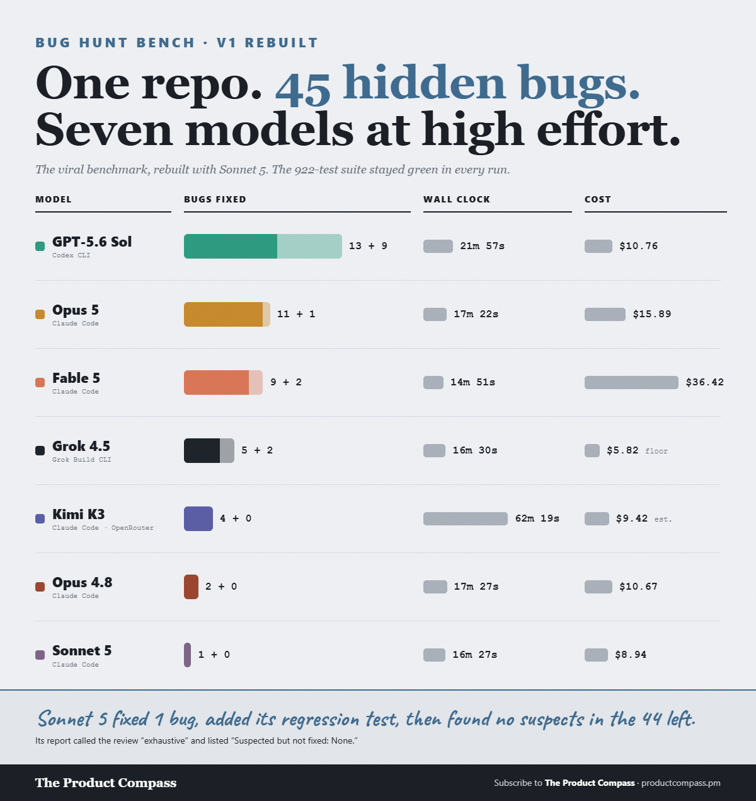
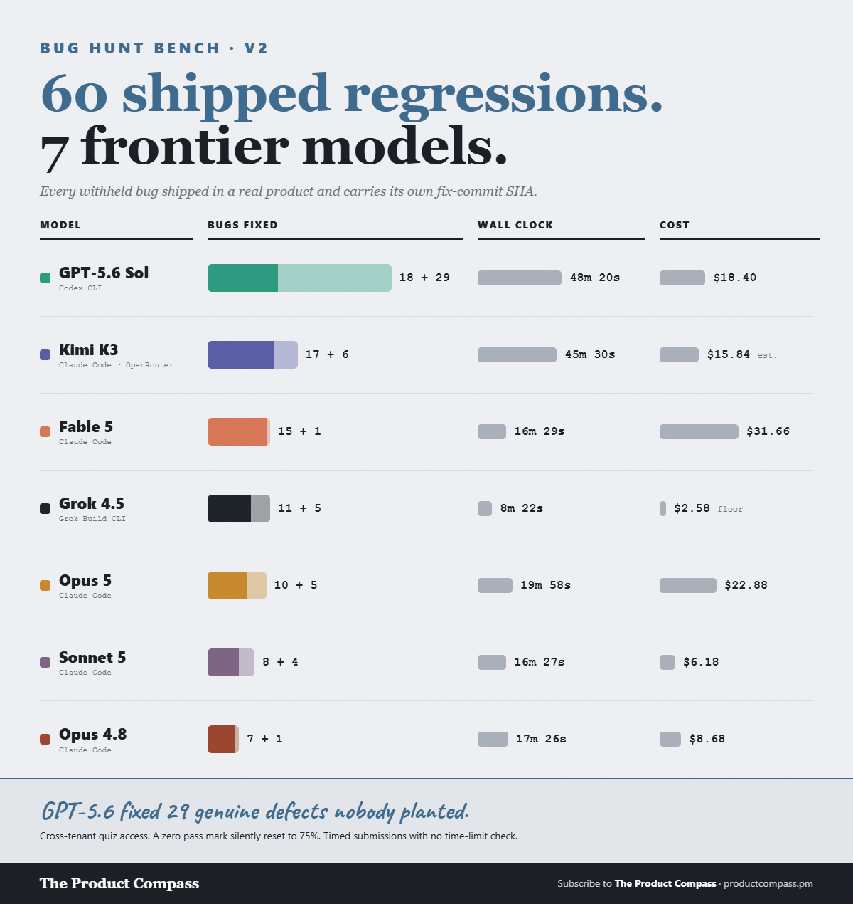

# bug-hunt-bench — 105 planted bugs, two real repos, seven coding models

**Question:** Hide bugs in a real codebase, keep the test suite green so nothing points at the
answers, then ask each frontier coding model — in its own native agentic CLI — to find and fix as
many as it can. Who actually fixes the most? And does a leaderboard built on one repo survive a
second, unrelated one?

Run twice, on two codebases that share nothing but a language.

| | Repo 1 | Repo 2 |
|---|---|---|
| What it is | A VS Code / Cursor sidebar extension (ACP client for a coding-agent CLI), ~28K lines TypeScript | A Vite/React/TypeScript LMS backed by Supabase Edge Functions and Clerk, ~60K lines |
| Bugs | **45** — 16 real shipped bugs reverted from the repo's own fix history, 29 authored in the same style | **60** — *every one* a real regression that shipped and was later fixed, each carrying its own fix-commit SHA |
| Green checks kept | 922 tests | 53 unit tests + typecheck + production build |
| Run | Jul 19–26, 2026 | Jul 26, 2026 |

Repo 2 is the stronger construction: no authored bugs at all. It was also built largely by AI,
and 59 of its 60 original fixes were written by an AI agent rather than a person.

**The task (identical for every model, both repos):** find and fix as many planted bugs as you can,
edit the source in place, keep the checks green (do not weaken tests), and write a `BUGS_FOUND.md`.
One round per model per repo, reasoning effort `high`, each in its native harness. Exact prompts:
[prompt.md](prompt.md) (repo 1) and [v2-prompt.md](v2-prompt.md) (repo 2).

**Grading:** each model's diff against the pristine repo is the ground truth — not its own report.
Scored against a withheld answer key by an independent blind judge per arm, submissions anonymized
and decoded only after every verdict is in. Buckets: `FIXED_MATCH` / `FIXED_PARTIAL` /
`CLAIMED_ONLY` / `MISSED`, plus extra fixes classified genuine or false-positive.

## Combined scoreboard

Strict fixes only — no partial credit. [combined-scoreboard.csv](combined-scoreboard.csv)

| Model | Harness | Fixed /105 | Repo 1 /45 | Repo 2 /60 | Genuine extras | Wall | Cost (list-equiv) |
|---|---|--:|--:|--:|--:|--:|--:|
| **GPT-5.6 Sol** | Codex CLI | **31** | 13 | 18 | 38 | 70.2 min | $29.16 |
| **Fable 5** | Claude Code | **24** | 9 | 15 | 3 | 31.4 min | $68.07 |
| **Opus 5** | Claude Code | **21** | 11 | 10 | 6 | 37.4 min | $38.77 |
| **Kimi K3** | Claude Code / OpenRouter | **21** | 4 | 17 | 6 | 107.8 min | $25.27 |
| **Grok 4.5** | Grok Build CLI (ACP) | **16** | 5 | 11 | 7 | 24.9 min | $8.40 floor |
| **Opus 4.8** | Claude Code | **9** | 2 | 7 | 1 | 34.8 min | $19.35 |
| **Sonnet 5** | Claude Code | **9** | 1 | 8 | 4 | 32.8 min | $15.12 |

**63 of the 105 bugs survived every model.** Zero false-positive fixes from any arm on either repo:
every extra fix any model applied was a genuine unplanted defect.

Per-repo detail: [scoreboard.csv](scoreboard.csv) (repo 1) · [v2-scoreboard.csv](v2-scoreboard.csv)
(repo 2). Wall-clock, tokens and reconstructed cost: [metrics.csv](metrics.csv) ·
[v2-metrics.csv](v2-metrics.csv).

## Findings

- **One repo was not enough to rank the middle.** Opus 5 beat Fable 5 on repo 1 (11–9) and lost on
  repo 2 (10–15). Kimi K3 went from second-to-last on repo 1 to second on repo 2, finishing level
  with Opus 5 overall at a third less cost. Only first place was stable.
- **GPT-5.6 Sol leads both, and audits beyond the brief.** It fixed **38 genuine defects nobody
  planted** across the two repos — 29 of them on repo 2 alone, where every other model found 1 to 6.
  Cross-tenant quiz access, a `|| 75` coercion silently rewriting a 0% pass mark to 75%, timed quiz
  submissions with no time-limit enforcement.
- **Sonnet 5 on repo 1 is the sharpest single result.** It fixed 1 of 45: two files touched, a 2.9KB
  diff, one correct fix *with a regression test*, then a report claiming an exhaustive line-by-line
  review of the codebase and listing "Suspected but not fixed: None". 44 bugs were still there.
  Confident, thorough-sounding, and wrong.
- **Opus 4.8 → Opus 5 is a real generational jump**: 9 → 21 combined, same harness, same prompt,
  same bugs.
- **Cost is not recall.** Fable 5 cost the most ($68) and placed second. Grok 4.5 was the cheapest
  arm by a wide margin and placed fifth. Kimi K3 matched Opus 5 for a third less money and three
  times the wall clock.

## Method notes & caveats

- **n = 1 per cell.** One round per model per repo. Re-scoring repo 2 under the same judge moved one
  arm by a single fix, so treat `fixed` as ±1 and extras as ±2. Deltas are directional, not a
  ranking to the bug. The Kimi/Opus 5 tie at 21 is a tie.
- **Native harnesses, not one fixed harness.** GPT in Codex CLI, Grok in the grok CLI over ACP, the
  Claude-family arms in Claude Code, Kimi K3 in Claude Code through an OpenRouter shim (it ships no
  CLI of its own). By design: each model in the harness its own vendor ships.
- **Judging changed between the two runs, and was checked.** Repo 1's published numbers were graded
  by Opus 4.8. Everything is now graded by GPT-5.5 (Codex), except the GPT-5.6 arm, which Grok 4.5
  grades so no model scores its own submission. Re-judging repo 1 under the new routing reproduced
  **all six previously published arms exactly** — strict fixes and extras, zero delta. That is what
  makes the two halves of the /105 addable. Details and two further controls:
  [judge-calibration.md](judge-calibration.md).
- **"Planted" undersells the set.** All 60 repo-2 bugs are real shipped regressions. On repo 1, 16 of
  45 are (a documented floor — squashed release commits hide bugs fixed inside one cycle).
- **The benchmarks are withheld to keep them usable.** The **answer keys, the seeded sources, and the
  per-model diffs are not published** — publishing them would burn both benches. Scoreboards, metrics
  and the exact prompts are here; the prompts are self-contained specs.
- **Two cost figures are not bills.** Grok's CLI reports context *fill*, not cumulative *spend*, so
  its cost is a reconstructed **floor** (the token-accounting defect written up in
  [five-models-three-harnesses/](../five-models-three-harnesses/)). Kimi's is a local price-table
  estimate of an OpenRouter charge. Don't rank costs across differently-metered arms to the dollar.
- **De-identified.** Repo 1 is a real, public VS Code extension. Repo 2 is a private product and is
  described only by its stack. Private paths are scrubbed; numbers, timestamps and verdicts are as
  produced.

## Per-repo cards

## Source posts

[@PawelHuryn on X](https://x.com/PawelHuryn/status/2078834615519731832) — the original single-repo
run. The two-repo result follows.

## License

MIT. Use anything; a link back is appreciated.
