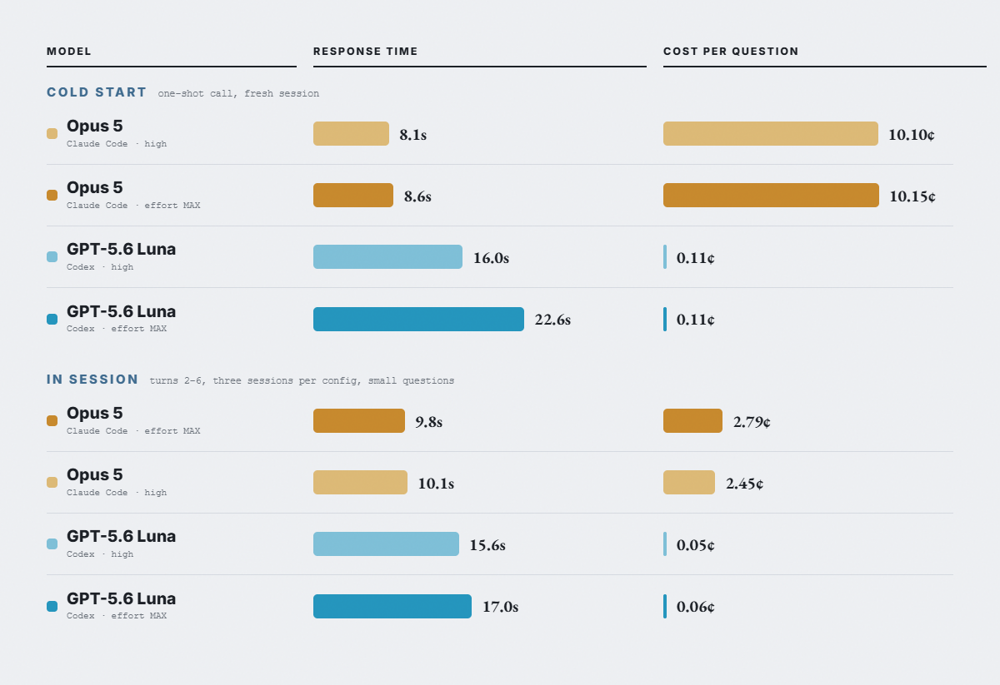

# small-question-latency-cost

What a **small, tool-free question** actually costs in time and money on Opus 5 versus GPT-5.6 Luna, measured two ways: as a cold one-shot CLI call, and as a follow-up turn inside a live session.

This set exists because "which model is faster" is usually answered with a number that quietly depends on how the question was asked. A cold invocation pays a prompt-cache write that a real conversation pays once. Measuring only cold overstates the cost of the expensive model; measuring only warm understates it. Both are here.

Everything ran in a **real repository** with an `AGENTS.md` pointing at a `CLAUDE.md`, so both harnesses load a comparable instruction payload. Runs are **sequential and interleaved** — config order rotates every round — because serving latency drifted up to 4x inside single 30-minute windows during this work, and a blocked design would have charged that drift to one arm.

## Experiments

| # | Question | Headline result |
|---|---|---|
| [01-cold-one-shot/](01-cold-one-shot/) | Time and cost per small question when every call is a fresh CLI invocation | **Opus 5 answers in about half the time at roughly 90x the cost** (8.1s / 10.10¢ vs 16.0s / 0.11¢). $0.087 of Opus's $0.101 is a prompt-cache write. Fast mode's documented 1.5x speedup did not reproduce; its 2-2.5x billing multiplier is real. n=5/cell |
| [02-in-session/](02-in-session/) | Does a warm session make later turns faster, and what happens to cost? | **No arm got faster — the cache was already ~92% warm on turn 1.** Opus's cost drops ~4x (10.10¢ → 2.45¢) as its cache write collapses from 14,027 tokens to ~260. Luna's per-turn cost stays flat and slightly cheaper (0.11¢ → 0.05¢). Gap narrows ~90x → ~43x. n=15 warm calls/cell, 3 sessions each |

## Shared method

- **Timing** is wall clock around the subprocess and **includes CLI startup and harness overhead** — what a user waits for, not API latency. Ratios travel; absolute seconds do not.
- **Cost** is API-equivalent, computed from each CLI's reported token counts at published list rates. Both models actually ran on subscriptions, where marginal dollar cost is zero. Rates were verified by recomputing three rows of an unrelated benchmark from raw token counts and matching the recorded totals to the cent ($1.3988, $22.8775, $26.5549).
- **Prompt prefix**, verbatim on every call: `Answer directly from your own knowledge in 2-3 sentences. Do not run any commands, do not read any files, do not use any tools.`

## Caveats that apply to the whole set

- **These are small questions.** At `high` effort Opus 5 barely reasons on them (0 thinking tokens at high, 500 at max, on a probe). Nothing here describes hard agentic work, where the same two models sat between **21x and 90x** on a find-and-fix benchmark over two repositories.
- **Codex reports cumulative thread totals; Claude reports per-request.** Deriving per-turn cost from Codex's counters without differencing inflates every later turn. Our first pass made exactly this error and reported warm Luna 5x too expensive with a cost that appeared to climb. `02-in-session/results.csv` carries raw, semantics, and derived columns side by side.
- **An empty working directory invalidates this comparison.** With no `AGENTS.md` to find, Codex shells out repeatedly hunting for context (76,431 input tokens on a probe vs 13,506 clean). A first version of experiment 01 ran that way and was discarded.
- **`codex exec resume` rejects `-s`**; sandbox is inherited from the opening call. Passing it kills every resumed turn instantly and silently enough to look like data.
